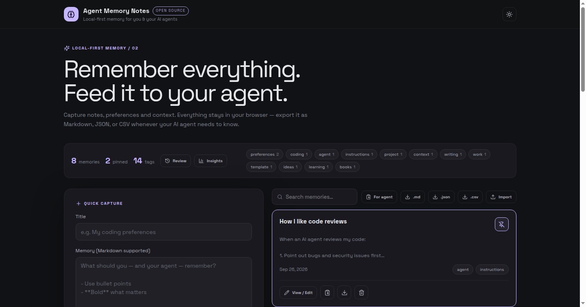

# Agent Memory Notes 🧠

> Local-first memory for you **and** your AI agents. Capture notes, preferences and context in your browser — then feed them straight into any agent's prompt.


🔗 **Live demo:** https://devilking7x.github.io/agent-memory-notes/
[](LICENSE)
[](https://devilking7x.github.io/agent-memory-notes/)
[](https://react.dev)
[](https://vitejs.dev)
[](https://www.typescriptlang.org)
[](#-privacy)

AI agents are only as good as the context you give them. **Agent Memory Notes** is the simplest possible memory layer: you capture what matters, it stays 100% in your browser, and one click turns it into an agent-ready prompt block.

## ✨ Features

- ⚡ **Quick capture** — title, body (Markdown), tags. Saved instantly, timestamped automatically
- 📌 **Pin important memories** — pinned items always float to the top
- 🔍 **Full-text search + tag filters** — find anything in milliseconds
- 🤖 **"Copy for agent"** — one click copies all memories as a paste-ready prompt block
- 🧠 **Spaced review** — flashcard-style review mode resurfaces memories you haven't looked at in a while, oldest-unseen first
- 🧹 **Duplicate detection** — fuzzy matching warns you before saving a near-duplicate memory
- 📊 **Insights** — hand-rolled charts: capture activity per week + top tags, plus stale-memory counts
- 📥 **Export** — single memory or everything, as Markdown, JSON, or CSV
- 📤 **Import** — bring a JSON or CSV export back anytime (timestamps preserved)
- 🏷️ **Tag cloud** with live counts — click to filter
- 🌓 **Dark / light theme**
- 🔒 **100% local** — localStorage only. No account, no server, no tracking

## 🚀 Quick Start

```bash
pnpm install
pnpm dev      # dev server
pnpm build    # production build → dist/
```

## 🤖 How to feed memories to your agent

1. Capture memories (coding preferences, project context, writing style…).
2. Click **"For agent"** — everything is copied as one Markdown block.
3. Paste it at the top of your agent's system prompt or chat.

### Option B: MCP server — agents read/write directly 🤖

The [`mcp-server/`](mcp-server/) directory is a [Model Context Protocol](https://modelcontextprotocol.io) server.
Connect it to Claude Code or Claude Desktop and the agent gets direct tools —
`memory_add`, `memory_search`, `memory_list`, `memory_update`, `memory_delete` —
no copy-paste needed:

```bash
cd mcp-server && npm install
claude mcp add agent-memory-notes -- node "$PWD/index.mjs"
```

Memories are stored in a local JSON file (`~/.agent-memory-notes/memories.json`),
in the same format as the app's JSON export, so both stay compatible.

It looks like this:

```markdown
# My memories

The following are things I want you to remember about me.
Use them as context when helping me.

---

# My coding preferences

When writing code for me:

- **TypeScript first**, strict mode, no `any`
- Small focused functions over clever one-liners

Tags: preferences, coding
Created: 2026-09-25

---
```

Works with ChatGPT, Claude, Copilot, Cursor, or any agent that takes a system prompt.

## 🔒 Privacy

Everything is stored in your browser's `localStorage` under the key `agent-memory-notes:v1`. There is no backend, no analytics, no network call that carries your notes. Export files are generated locally via Blob download.

## 🗂️ Project structure

```
client/src/
├── pages/Home.tsx            # the whole app (single-page)
├── components/
│   ├── MemoryCard.tsx        # memory list item
│   └── MemoryDialog.tsx      # view / edit modal
├── lib/memory.ts             # types, storage, seed data, export formats
├── contexts/ThemeContext.tsx # dark / light theme
└── index.css                 # theme variables + app styles
```

## 📸 Screenshots



## 🗺️ Roadmap

- [ ] Folders / collections
- [ ] Semantic search (local embeddings)
- [ ] Browser extension for one-click capture
- [ ] Sync via export-to-GitHub-gist
- [ ] PWA + offline install

## 🤝 Contributing

PRs welcome! See [CONTRIBUTING.md](CONTRIBUTING.md).

## 📄 License

MIT — see [LICENSE](LICENSE).
